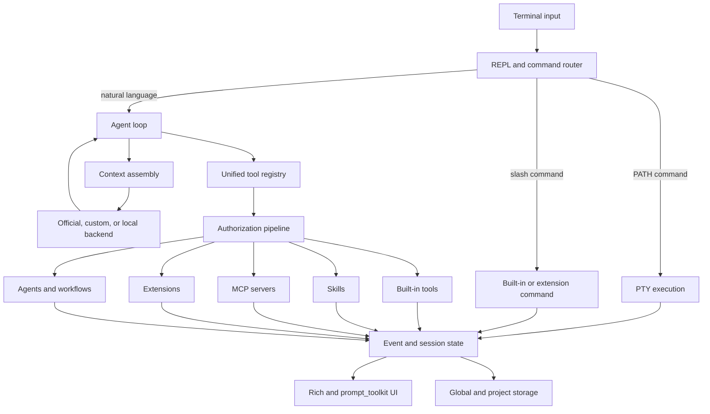

# Laintas CLI

**Cross-platform autonomous AI agent for terminal work**

[Download](https://cli.laintas.com) · [Documentation](https://laintas.com/docs) · [Releases](https://github.com/lin7c/Laintas_cli/releases) · [Laintas](https://laintas.com)

Laintas CLI combines a normal interactive shell with an agent runtime. Shell commands still run directly in a real PTY; natural-language tasks enter an iterative agent loop that can inspect the workspace, call tools, delegate work, and continue from the results.

It is designed for developers, server operators, and remote workspaces that want an AI agent close to the filesystem and terminal—not isolated in a separate chat window.

## Highlights

- Direct shell commands bypass the model and retain normal PTY behavior.
- Natural-language tasks run as observable, interruptible tool-use loops.
- Named sub-terminals support interactive programs and long-running processes.
- Agents, HWO workflows, and durable HWG graphs support parallel or staged work.
- Built-in tools, skills, MCP servers, and extensions share one tool registry.
- Modes, roles, workflow phases, policy, trust, and hooks constrain execution in layers.
- Project memory, plans, events, traces, tasks, and workflow state survive restarts.
- Official, custom, and local backends have separate credential boundaries.
- Browser automation, Helpwo, shared storage, PPOS, and Enterprise integrations are optional.

## Install and Start

Linux standalone releases target 64-bit glibc systems on `x86_64` and
`aarch64`; the installer selects the matching binary automatically:

```bash
curl -fsSL https://cli.laintas.com/install.sh | bash
laintas-cli
```

On 64-bit Windows 10 2004+ or Windows 11, the single-file Windows installer imports a
private `Laintas-CLI` WSL 2 distribution and installs a native
`laintas-cli.exe` launcher. Normal startup calls `wslapi.dll` directly, does
not run `wsl.exe`, and does not change the user's default WSL distribution.
The installer lets the user choose the local installation drive and offers
to start Laintas CLI on its final page:

```powershell
irm https://cli.laintas.com/install.ps1 | iex
laintas-cli
```

Check the host before installing:

```bash
uname -m
getconf LONG_BIT
ldd --version
```

For unsupported native targets, development, or auditing, use the source package:

```bash
unzip laintas-cli_source.zip
cd laintas-cli-source
python3 -m pip install -r requirements.txt
python3 laintas_cli.py
```

Optional browser, MCP, WebRTC, and advanced web-fetch dependencies are documented in `requirements.txt`.

## Architecture

Laintas CLI is a modular monolith: latency-sensitive UI, policy, state, and tool dispatch remain in one local process, while model inference and optional integrations cross explicit boundaries. The public customization surfaces are configuration files, project files, skills, MCP, extensions, and hooks; internal Python modules are not all stable plugin APIs.



### Request lifecycle

1. **Classify input.** The REPL distinguishes slash commands, executable commands on `PATH`, and natural-language tasks.
2. **Route locally when possible.** Direct commands run in a PTY. Slash commands are resolved from the built-in registry and loaded extensions.
3. **Assemble agent context.** The runtime combines stable instructions with the active mode, project prompt, rules, memory, plan, role, workflow phase, and current terminal state.
4. **Call the backend.** The active backend profile decides the origin, authentication boundary, billing label, and model request.
5. **Dispatch structured tool calls.** Built-in, skill, MCP, and extension tools are exposed through one registry and namespaced by source.
6. **Authorize every action.** Deny rules are evaluated across mode, workflow phase, agent role, global or organization policy, trust state, approval state, and pre-tool hooks.
7. **Execute and observe.** The tool runs locally, its structured result is recorded, and relevant output is returned to the model for the next iteration.
8. **Persist and render.** Events, history, trace details, usage, tasks, plans, memory, and workflow state feed both recovery and the terminal UI.

The runtime policy—not the prompt—is the security boundary. Prompt instructions shape behavior, but cannot grant a tool that a policy layer denied.

### Subsystems and module boundaries

| Subsystem | Principal modules | Responsibility | Supported customization surface |
|---|---|---|---|
| Entry and routing | `laintas_cli.py`, `command_parse.py` | REPL, slash command registry, input classification, authentication, PTY routing | Runtime config, project commands, extensions |
| Agent runtime | `agent_loop.py`, `precheck.py`, `critic.py`, `redactor.py`, `stuck_signals.py`, `tokenizer.py` | Iteration, context budgeting, response parsing, safety checks, completion evaluation | Prompt, modes, rules, skills, policy |
| Terminal UI | `resource_ui.py`, `detail_trace.py`, `agents_mode.py`, `agent_ui_events.py`, `repl_mirror.py`, `symbols.py`, `terminal_preferences.py` | Browsers for resources and traces, agent events, terminal rendering, theme preferences | `/theme`, terminal preferences, extension command metadata |
| Tool runtime | `tools.py`, `agent_tools/`, `patch_adapter/`, `format_adapter/`, `diagnostics_adapter/` | Unified registry, filesystem/process/browser tools, patching and normalized results | Skills, MCP, extensions, policy |
| Authorization | `policy.py`, `trust_store.py`, `durable_rules.py`, `hooks.py` | Layered allow/deny decisions, executable trust, persistent constraints, lifecycle interception | Policy, project trust, rules, hooks |
| State and recovery | `paths.py`, `json_store.py`, `event_log.py`, `session_store.py`, `snapshot.py`, `usage_tracker.py` | Secure paths, atomic state, replayable events, sessions, snapshots, usage | Global and project data files |
| Memory and context | `memory_system.py`, `mem_extract.py`, `mem_recall.py`, `mem_signals.py`, `rag_signals.py` | Typed memory capture, retrieval, relevance signals, prompt injection | `/memory`, project memory, project prompt |
| Planning and tasks | `plan_mode.py`, `task_manager.py`, `workgraph.py`, `workflow_state.py` | Versioned plans, dependencies, approvals, durable graph state | `/plan`, `/task`, `/rule`, workflow definitions |
| Multi-agent execution | `agent_persistence.py`, `agent_roles.py`, `peer_coordination.py`, `worktree_manager.py`, `hwo_runner.py`, `hwo_ui.py`, `hwg_runner.py`, `workflow_engine.py` | Agent lifecycle, leases, roles, worktrees, orchestrated and resumable workflows | Role/workflow commands, skills, extension tools |
| Plugin systems | `skills.py`, `skill_router.py`, `mcp_client.py`, `extension_runtime.py`, `extension_manager.py`, `evolution_lab.py`, `evolution_runner.py` | Discovery, trust, lifecycle, registration, cleanup, experimental activation | `SKILL.md`, `skill.py`, `mcp.json`, extension packages |
| Backend boundary | `backend_profiles.py`, `cloud_provider.py`, `ppos_client.py` | Origin classification, credential isolation, provider-specific calls | Backend profiles and environment references |
| Web and browser | `browser_session.py`, `web_search.py`, `cookie_store.py`, `identity_store.py` | CDP browser control, search/fetch chain, explicit browsing identity | `/web`, `/identity`, proxy and browser config |
| Remote integrations | `helpwo_server.py`, `shared_storage.py`, `webrtc_channel.py` | Browser-to-local runtime bridge, file sharing, peer transport | Helpwo and account configuration |
| Distribution | `updater.py`, `release.py`, `enterprise.py`, `enterprise_installer.py`, `migrate.py` | Updates, signed packages, Enterprise add-ons, migrations | Release channel and signed extensions |

### UI architecture

The normal REPL uses Rich for streamed output and prompt-toolkit for input. Resource-oriented commands use a shared full-screen browser model:

- `resource_ui.py` owns list/detail navigation, responsive split or single-pane layout, search, focus, and common key handling.
- `detail_trace.py` records assistant output and tool request/result content so `/detail trace` can inspect what the model received or changed.
- `/told`, `/plan`, `/memory`, `/skill`, and related resources adapt their domain data to the shared browser instead of reimplementing navigation.
- `agents_mode.py` and `hwo_ui.py` remain specialized workspaces because their live event and input semantics differ from static resource browsing.

This separation keeps interaction behavior consistent without forcing every command into the same screen model.

### State layout

Global state is user-scoped; project state travels with a workspace. Private directories and files are created with restrictive permissions, and executable customization rejects unsafe ownership or symlink conditions.

| Location | Examples | Scope |
|---|---|---|
| `~/.laintas/config.json` | Runtime preferences and feature settings | User |
| `~/.laintas/session.json` | Authentication/session state | User, private |
| `~/.laintas/policy.json` | Global tool and command policy | User |
| `~/.laintas/backends.json` | Backend profiles and credential references | User |
| `~/.laintas/mcp.json` | MCP process definitions | User |
| `~/.laintas/hooks.json`, `hooks.py` | Declarative and Python lifecycle hooks | User |
| `~/.laintas/skills/` | User-installed skills | User |
| `~/.laintas/extensions/` | Global extensions | User |
| `~/.laintas/memory/`, `plans/`, `agents/`, `sessions/` | Durable runtime data | User |
| `.laintas/cli.prop` | Project system instructions | Project |
| `.laintas/memory.json` | Project-scoped memory | Project |
| `.laintas/rules.json` | Persistent workspace rules | Project |
| `.laintas/modes.json` | Custom modes | Project |
| `.laintas/commands.py`, `loop.py` | Executable project callbacks | Project, trusted |
| `.laintas/extensions/` | Workspace-local extensions | Project, trusted |
| `.laintas/evolution-lab/` | Generated candidates and activation metadata | Project |

Project extensions shadow global extensions with the same name. User skills likewise override bundled skills with the same declared skill name.

## Customization Model

Use the narrowest surface that solves the problem:

| Need | Preferred surface | Executes code? | Trust required? |
|---|---|---:|---:|
| Change general behavior | `config.json`, `/config` | No | No |
| Add project instructions | `.laintas/cli.prop` | No | No |
| Preserve facts or constraints | Memory and rules | No | No |
| Restrict tools for a working style | `.laintas/modes.json` | No | No |
| Add a small project slash command | `.laintas/commands.py` | Yes | Project hash trust |
| Handle a project loop command | `.laintas/loop.py` | Yes | Project hash trust |
| Add reusable guidance | `SKILL.md` | No | No |
| Add reusable in-process tools | `skill.py` | Yes | Skill hash trust |
| Connect an external tool server | `mcp.json` | Child process | MCP config trust |
| Add commands, tools, and lifecycle logic | Extension | Yes | Signature or hash trust |
| Intercept runtime events | Hooks | Maybe | Executable hook trust |
| Use another inference endpoint | Backend profile | Remote service | Explicit profile config |

### 1. Project prompt, memory, and rules

`.laintas/cli.prop` is appended to the project instruction context. It is data, not Python, and is the right place for repository conventions such as test commands, formatting rules, or architectural constraints.

Use `/memory` for durable facts and `/rule` for recurring constraints. Keep instructions concise: they consume context on every relevant turn, and they are behavioral guidance rather than an authorization mechanism.

### 2. Custom modes

Modes combine instructions with a restrictive tool posture. Built-in modes include `act`, `review`, `study`, `auto`, and `mail`; plan mode owns a separate plan lifecycle. Project modes live in `.laintas/modes.json` and can also be created through `/mode create`.

```json
{
  "version": 1,
  "active": "docs-review",
  "modes": {
    "docs-review": {
      "description": "Review documentation without modifying the workspace",
      "instructions": "Check correctness, structure, examples, and broken references.",
      "allowed_tools": ["fs.read", "fs.grep", "fs.glob"],
      "denied_tools": ["shell.*", "fs.write", "fs.edit"],
      "auto_approve": "none"
    }
  }
}
```

`denied_tools` wins over `allowed_tools`. A missing allowlist means “all tools allowed by this mode,” not “bypass other controls.” The effective set is still intersected with workflow, role, global/organization policy, and trust decisions. Tool names may use supported glob patterns.

### 3. Project slash and loop commands

For small workspace-only behavior, define `.laintas/commands.py`:

```python
def handle_extra_command(action, parts, ctx):
    if action != "/project-status":
        return False
    ctx["console"].print("Project checks are ready.")
    return True
```

`.laintas/loop.py` may define `handle_loop_command(command, ctx)` for project-specific loop handling. Both files execute inside the CLI process with the current user's permissions. Review them, then approve their exact hashes with `/trust allow`; changing either file invalidates that approval.

Use an extension instead when the command needs metadata, reusable packaging, multiple tools, installation, or teardown.

### 4. Skills

A skill is a directory under `~/.laintas/skills/<name>/` or the bundled `default_skills/` tree.

```text
my-skill/
├── SKILL.md          # name, description, version, instructions
├── references/       # loaded only when the skill needs them
├── skill.py          # optional get_tools()
└── extension.json    # required for executable skill capabilities
```

The lightweight frontmatter in `SKILL.md` is indexed at startup. Full instructions are loaded only when the skill is activated, and references can be loaded on demand. This progressive loading limits startup time and context usage.

Documentation-only skills do not execute code. An executable skill defines `get_tools()` in `skill.py`, declares capabilities in `extension.json`, and passes hash trust before registration. Its tools are tracked as `skill:<name>` so unloading can remove them transactionally.

### 5. MCP servers

MCP is appropriate when tools already run as a separate service or should have their own dependency environment. Configure servers in `~/.laintas/mcp.json`:

```json
{
  "servers": {
    "example": {
      "command": "/absolute/path/to/example-server",
      "args": ["--stdio"],
      "env": {"EXAMPLE_TOKEN": "..."},
      "cwd": "/absolute/path/to/workspace",
      "enabled": true,
      "call_timeout": 30,
      "capabilities": ["fs.read"]
    }
  }
}
```

The MCP manager owns a background asyncio loop and bridges stdio JSON-RPC tools into the synchronous registry as `mcp.<server>.<tool>`. It starts child processes with a minimal environment plus explicitly configured variables. Trust is tied to the server configuration hash; edit the launch configuration and it must be reviewed again.

### 6. Extensions

Extensions are the broadest supported customization unit. They may register slash commands, tools, loop handlers, and teardown logic. A project extension lives at `.laintas/extensions/<name>/`; a global one lives at `~/.laintas/extensions/<name>/`.

```text
example/
├── extension.json
└── main.py
```

```json
{
  "schemaVersion": 2,
  "name": "example",
  "version": "0.1.0",
  "entrypoint": "main.py",
  "description": "Example Laintas extension",
  "author": {"name": "Your Name"},
  "license": "MIT",
  "toolPrefix": "example."
}
```

`main.py` exports `setup(ctx)` and may export teardown behavior. The context exposes narrowed registration and backend-call helpers; raw official authentication material is not handed to the extension. This reduces accidental credential leakage, but Python extensions still run with the full permissions of the local user.

Installation and trust paths:

| Source | Command | Trust mechanism |
|---|---|---|
| Official extension | `/extensions install laintas/<name>` | Official registry hash plus explicit approval |
| Community package | `/extensions install @author/<name>` | Immutable artifact hash, fresh static and AI source review, explicit approval |
| Local package | `/extensions install <path-or-url>` | Explicit content-hash approval |
| Evolution Lab candidate | `/evolve` | Test, activation, and rollback workflow |

Browse the marketplace with `/extensions available`, narrow it with
`/extensions available official` or `/extensions available community`, and
search both sources with `/extensions search <keyword>`. `/extensions list`
continues to show only extensions installed on the current machine.

Use `/extensions create` to scaffold a package and `/extensions pack` to produce a distributable `.lext` archive. An installed extension can be published with `/extensions publish <name>`: the CLI uploads `extension.lext` and `publish.json` under `Extensions/<name>` in Laintas Storage, then commits an immutable community-registry version. Community packages are never presented as official packages and cannot use the `laintas` publisher namespace.

Every community installation verifies the published SHA-256, extracts within strict size and file-count limits, runs deterministic checks, and submits the source to a fresh tool-less AI review. The report is advisory rather than a sandbox: community Python still executes with the local user's permissions, every installation requires confirmation, critical findings are blocked, and scanner failure stops installation.

`toolPrefix` must be lower-case and dot-terminated. Without a custom prefix, the runtime assigns an extension-owned namespace. Legacy manifests without an `install` block remain loadable for backward compatibility.

### 7. Hooks

Hooks observe or gate events such as command/tool execution, session start/end, errors, and memory changes.

- Declarative hooks in `~/.laintas/hooks.json` run an argument vector with `shell=False`, receive event JSON on standard input, and support conditions, timeouts, and `block_on_failure`.
- Python callbacks in `~/.laintas/hooks.py` provide richer in-process behavior and require executable trust.

Use declarative hooks for audit forwarding or deterministic checks. Use Python only when the event requires local program logic. A blocking hook fails closed when configured to do so.

### 8. Backend profiles

Backend profiles live in `~/.laintas/backends.json` and divide inference endpoints into trust domains:

- **Official** — exact Laintas origins; may receive the Laintas session and use managed billing.
- **Custom** — an explicit HTTPS endpoint with a separate `env:VARIABLE` or `keyring:service/user` credential reference; external and unmetered by Laintas.
- **Local** — loopback development endpoint without authentication.

Custom endpoints cannot declare themselves official. Authenticated calls refuse unsafe cross-origin redirects, Laintas credentials are never forwarded to custom hosts, and custom tokens are never sent to official origins. Configure profiles with `/backend` instead of embedding secrets in URLs or checked-in files.

### 9. Workflows, agents, and UI behavior

Agent roles and workflow phases can narrow tools and specialize instructions for a stage of work. HWO handles live multi-agent orchestration; HWG compiles durable, resumable work graphs. Their state is persisted separately from ordinary chat history so a failed terminal session does not silently complete a workflow.

For new domain behavior, prefer composing roles and workflows with registered skill/MCP/extension tools. Editing `hwo_runner.py`, `workflow_engine.py`, or UI internals directly is core development, not a compatibility-stable customization path.

Theme and terminal behavior are user preferences exposed by commands such as `/theme` and `/config`. Resource screens inherit shared styles and key bindings; specialized live workspaces add only interactions required by their domain.

## Security Boundaries

Customization is intentionally split into declarative and executable surfaces:

- Prompt files, memory, rules, modes, and backend metadata do not execute local code, though untrusted project text can still influence model behavior.
- Project callbacks, skill tools, extensions, MCP launch definitions, and Python hooks require trust tied to the reviewed content or configuration.
- Symlink and ownership checks protect executable project customization from path substitution.
- Tool authorization is deny-first and evaluated at execution time, not only when the model receives its tool list.
- MCP and extension namespaces prevent accidental tool-name collisions and make cleanup source-aware.
- Evolution Lab provides testing, activation, and rollback; it is not a hostile-code sandbox.

See [`SECURITY_CUSTOMIZATION.md`](SECURITY_CUSTOMIZATION.md) for the threat model and exact trust behavior.

## Command Map

Run `/help` for the authoritative list for your installed version, including extension commands.

| Area | Commands | Purpose |
|---|---|---|
| Session | `/login`, `/resume`, `/told`, `/detail` | Authentication, recovery, conversation and trace inspection |
| Behavior | `/mode`, `/plan`, `/model`, `/config`, `/theme` | Working posture, planning, model override, preferences |
| Knowledge | `/memory`, `/rule`, `/skill` | Persistent context, constraints, progressive skills |
| Execution | `/term`, `/spawn`, `/agents`, `/task` | Terminals, delegated agents, and task tracking |
| Workflows | `/hwo`, `/hwg` | Live orchestration and durable graph execution |
| Plugins | `/mcp`, `/extensions`, `/evolve`, `/reload`, `/trust` | External tools and executable customization |
| Connectivity | `/backend`, `/web`, `/identity`, `/helpwo` | Inference, search/fetch, browser identity, remote runtime |
| Administration | `/policy`, `/usage`, `/training`, `/v`, `/org` | Policy, allowance, data preference, updates, Enterprise |

## Development

```bash
python3 -m venv venv
source venv/bin/activate
python -m pip install -r requirements.txt
venv/bin/python -m pytest
```

The download site is a separate Vite application:

```bash
cd laintas_cli_download
npm install
npm run dev
```

The package manifest is intentionally explicit. When adding a runtime module, bundled skill, or adapter, update `package_manifest.json` and verify both source and standalone distributions—not only execution from a repository checkout.

## Release Artifacts

`.github/workflows/release.yml` publishes:

- Linux amd64 standalone archive
- Linux arm64 standalone archive
- Single-file Windows amd64 installer with a private WSL 2 root filesystem
- Linux amd64 Debian package
- Linux-compatible source archive
- SHA-256 checksums and source-update manifests

The download page offers the one-line Linux installer, which selects the
architecture-specific ELF asset, alongside a direct link to every artifact the
release publishes: the single-file Windows installer
(`laintas-cli_windows_amd64_setup.exe`), both Linux archives, the Debian
package and the source zip. Those links, the install scripts and `/v update`
all read the GitHub release the CI workflow publishes.

## Version History

The history below is curated from the repository tags and changes, following an Added/Changed/Fixed-style release-note structure rather than reproducing raw commit messages. The tagged public history currently represented in this repository begins at v1.3.0.

### [v1.19.0](https://github.com/lin7c/Laintas_cli/releases/tag/v1.19.0) — 2026-08-23

**Added**

- Added an evidence-bound second-pass review for compaction summaries: an
  independent reviewer model decomposes the candidate into atomic claims,
  checks each against the source transcript, and applies minimal corrections.
- Added chunked summarization (`summary_chunk_tokens`) so long sessions compact
  without truncation, plus dedicated `summary_model` and
  `summary_review_model` settings in `context_policy/policy.json`.
- Added stream salvage: a transport that dies mid-answer now produces a
  truncated-but-usable turn instead of silently losing the whole reply.
- Added a terminal watchdog that detects launch-directory loss at startup and
  recovers instead of failing every subsequent command.
- Added silence-based budgets for shell, remote (WebRTC), and MCP tool calls:
  commands are bounded by output silence, not a fixed wall clock, so long
  builds and slow-but-streaming servers finish instead of being killed
  mid-run. Per-server MCP `call_timeout` still overrides (clamped to 300s).
- Added bounded ranking-result caches to memory recall and skill routing,
  collapsing per-loop rank calls into roughly one per run even with many
  concurrent agents.

**Changed**

- Hardened sub-agent supervision: failed children, denied writes, and silent
  children are now surfaced and harvested instead of disappearing; approval
  ancestry is tracked across agent generations.
- Raised the compaction protection window to 40k tokens so loaded skills,
  memories, and rules survive context pruning.
- Shared `/tmp` cleanup commands now pass an explicit safety check, and
  `os.ttyname` absence is guarded on platforms that lack it.
- Registered `hwg_view`, `hwo_view`, and `workflow_viz` in
  `package_manifest.json` so the interactive workflow viewers ship in every
  release artifact.

### [v1.18.0](https://github.com/lin7c/Laintas_cli/releases/tag/v1.18.0) — 2026-08-20

**Added**

- Added an API contract store where backend and frontend agree on endpoint
  shapes through propose/agree/implement/verify states with drift detection.
- Added local-runtime loopback so spawned runtimes answer on a local port,
  git attribution recording which agent produced each change, and fork
  lineage hardening for worktrees.

**Fixed**

- Self-healed the stale asyncio running-loop flag that froze the REPL after
  certain interrupts, and stopped the background input reader before
  restoring the SIGINT handler.

**Removed**

- Removed Mail mode entirely: the `mail` mode, the `/mail` command, the
  `mail.send_to_user` and `mail.check_inbox` tools, the new-mail watcher, the
  send-a-report-on-task-complete hook, and the email approval channel that stood
  in for a terminal prompt when nobody was watching. The gateway side went with
  it — the mailbox, the inbound-mail webhook, the approval links, and the whole
  `notifications` module. Outbound mail was the only consumer of the Resend
  integration, so those credentials are now unused.

### [v1.16.0](https://github.com/lin7c/Laintas_cli/releases/tag/v1.16.0) — 2026-08-14

**Added**

- Added a unified resource browser for conversation, trace, plan, memory, skill, and related detail views.
- Added detailed assistant/tool trace capture while keeping normal chat output compact.
- Added peer coordination and resume leases for safer multi-agent ownership.

**Changed**

- Reworked Agents and HWO into purpose-built terminal workspaces with clearer input, event, action, and status regions.
- Moved shared resource screens to a green/red palette with purple accents, responsive list/detail layouts, and consistent search/navigation.
- Reduced redundant raw tool output stored in short-term memory logs.
- Hardened training-data capture defaults and HMAC signing behavior.

**Fixed**

- Fixed search focus, match highlighting, result positioning, empty-history selection, and detail-page content regressions across resource UIs.
- Fixed trace views so assistant replies and full tool results—including complete edited-file content where recorded—remain inspectable.

### [v1.15.0](https://github.com/lin7c/Laintas_cli/releases/tag/v1.15.0) — 2026-08-12

**Added**

- Added centralized SSO through `accounts.laintas.com`.
- Added HMAC-signed event/training records and persisted critic assessments.
- Added keyless Tavily search fallback and skill unload cleanup.

**Changed**

- Stabilized prompt prefixes to improve cache hits and PTY echo behavior.
- Made Enter consistently submit input while preserving explicit multiline behavior.

### [v1.14.0](https://github.com/lin7c/Laintas_cli/releases/tag/v1.14.0) — 2026-08-11

**Added**

- Added allowance recovery countdowns to `/usage`.
- Added the last assistant output to `/resume` context.
- Added clearer diff and block styling for tool output.

**Fixed**

- Fixed plan work session-ID scope mismatches.

### [v1.13.0](https://github.com/lin7c/Laintas_cli/releases/tag/v1.13.0) — 2026-08-10

**Added**

- Added a secured PPOS agent client with tool, skill, and workgraph integration.
- Added gateway skill coverage and integration tests.

**Fixed**

- Fixed Rich prompt flows that required an extra Enter or mishandled confirmation input.

### [v1.12.0](https://github.com/lin7c/Laintas_cli/releases/tag/v1.12.0) — 2026-08-09

**Added**

- Added the generic extension manager and `/extensions` lifecycle for custom and community packages.
- Added extension trust approval, command metadata, multilevel completion, and `/help` integration.
- Added Enterprise module packaging.

**Changed**

- Unified Enterprise installation and update handling under `/v enterprise` and `/v update`.

### [v1.11.0](https://github.com/lin7c/Laintas_cli/releases/tag/v1.11.0) — 2026-08-08

**Added**

- Added the shared-storage channel and `file_push` tool for Laintas Storage and Helpwo.
- Added Enterprise installer extension roots.
- Added organization policy and CLI call-pack configuration.

### [v1.10.3](https://github.com/lin7c/Laintas_cli/releases/tag/v1.10.3) — 2026-08-07

**Added**

- Added `/v enterprise` installation and command-configurable custom backends.
- Added on-device organization-policy chain verification.

**Changed**

- Hardened command authorization using parsed shell structure instead of shallow string checks.

### [v1.10.2](https://github.com/lin7c/Laintas_cli/releases/tag/v1.10.2) — 2026-08-05

**Fixed**

- Fixed Rich rendering of literal brackets and symbol placeholders.

### [v1.10.1](https://github.com/lin7c/Laintas_cli/releases/tag/v1.10.1) — 2026-08-05

**Changed**

- Restricted the Helpwo local bridge to loopback by default and separated explicit remote exposure.
- Added HTTPS support and reuse of CLI account, model, and usage state for Helpwo.

**Fixed**

- Fixed non-streaming chat proxy behavior, browser expectation validation, and damaged/truncated tool-call detection.

### [v1.10.0](https://github.com/lin7c/Laintas_cli/releases/tag/v1.10.0) — 2026-08-05

**Added**

- Added a configurable search-engine chain, proxy support, cookie handling, and `laintas_search`.
- Added PySocks to the core distribution.
- Added per-model output budgets.

**Changed**

- Hardened web fetching and browsing-identity isolation.

<details>
<summary><strong>v1.9.x releases</strong></summary>

### [v1.9.8](https://github.com/lin7c/Laintas_cli/releases/tag/v1.9.8) — 2026-08-03

- Changed `/v` download progress to a stable single-line display written directly to the controlling terminal.

### [v1.9.7](https://github.com/lin7c/Laintas_cli/releases/tag/v1.9.7) — 2026-08-03

- Added study mode and raw terminal read/send output.
- Added browser-egress tests, VNC fallback, and plan-listing guards.
- Centralized UI symbols and fixed multi-terminal scheduling, browser behavior, and resume autosave.

### [v1.9.6](https://github.com/lin7c/Laintas_cli/releases/tag/v1.9.6) — 2026-07-27

- Improved context-compression reliability.
- Fixed task-management priority issues, loop warnings, and skill cleanup.

### [v1.9.5](https://github.com/lin7c/Laintas_cli/releases/tag/v1.9.5) — 2026-07-25

- Fixed SSL CA hook registration in frozen standalone builds.

### [v1.9.4](https://github.com/lin7c/Laintas_cli/releases/tag/v1.9.4) — 2026-07-25

- Maintenance release and artifact repackaging; no separate user-facing feature delta is recorded between adjacent tags.

### [v1.9.3](https://github.com/lin7c/Laintas_cli/releases/tag/v1.9.3) — 2026-07-25

- Maintenance release and artifact repackaging; no separate user-facing feature delta is recorded between adjacent tags.

### [v1.9.2](https://github.com/lin7c/Laintas_cli/releases/tag/v1.9.2) — 2026-07-25

- Improved update-download progress visibility.

### [v1.9.1](https://github.com/lin7c/Laintas_cli/releases/tag/v1.9.1) — 2026-07-23

- Added the offline Helpwo runtime bridge.

### [v1.9.0](https://github.com/lin7c/Laintas_cli/releases/tag/v1.9.0) — 2026-07-21

- Added full-screen Agents mode, auto-pilot, triggers, agent switching, cascade abort, and multi-agent working-directory handling.
- Added WebRTC security controls, update-integrity checks, Markdown themes, the `/told` browser, Helpwo commands, and Esc soft interruption.
- Hardened concurrency, state corruption recovery, memory cleanup, tool rendering, and slash-command handling.

</details>

<details>
<summary><strong>v1.8.x releases</strong></summary>

### [v1.8.8](https://github.com/lin7c/Laintas_cli/releases/tag/v1.8.8) — 2026-07-19

- Restored the full-screen Agents experience with a single foreground-terminal UI model.

### [v1.8.7](https://github.com/lin7c/Laintas_cli/releases/tag/v1.8.7) — 2026-07-17

- Added cross-device CLI login and stabilized runtime/terminal UI behavior.

### [v1.8.6](https://github.com/lin7c/Laintas_cli/releases/tag/v1.8.6) — 2026-07-16

- Improved reliability of CLI restart and replacement flows.

### [v1.8.5](https://github.com/lin7c/Laintas_cli/releases/tag/v1.8.5) — 2026-07-16

- Updated download-site builds and release packaging.

### [v1.8.4](https://github.com/lin7c/Laintas_cli/releases/tag/v1.8.4) — 2026-07-16

- Mirrored the complete release asset set to the self-hosted distribution channel.

### [v1.8.3](https://github.com/lin7c/Laintas_cli/releases/tag/v1.8.3) — 2026-07-16

- Release maintenance; no distinct source delta is recorded between adjacent tags.

### [v1.8.2](https://github.com/lin7c/Laintas_cli/releases/tag/v1.8.2) — 2026-07-15

- Included skill documentation in source-update packages.

### [v1.8.1](https://github.com/lin7c/Laintas_cli/releases/tag/v1.8.1) — 2026-07-14

- Release maintenance; no distinct source delta is recorded between adjacent tags.

### [v1.8.0](https://github.com/lin7c/Laintas_cli/releases/tag/v1.8.0) — 2026-07-11

- Added Mail mode, mail send/inbox, email approvals and reports, and rate-limit retry.
- Added self-hosted `/v` release channels and download progress.
- Added mode allow/deny policy, auto-approval behavior, and Esc interruption.
- Fixed packaged-module coverage and Act-mode execution behavior.

</details>

<details>
<summary><strong>v1.7.x–v1.3.x releases</strong></summary>

### [v1.7.4](https://github.com/lin7c/Laintas_cli/releases/tag/v1.7.4) — 2026-07-10

- Introduced the green/red terminal theme, direct terminal-like command behavior, a static caret, and framed diffs.

### [v1.7.3](https://github.com/lin7c/Laintas_cli/releases/tag/v1.7.3) — 2026-07-10

- Improved installer progress and archive layout.
- Moved public downloads to `cli.laintas.com` and documented platform compatibility.

### [v1.7.1](https://github.com/lin7c/Laintas_cli/releases/tag/v1.7.1) — 2026-07-10

- Fixed Debian release packaging through `fpm`.

### [v1.7.0](https://github.com/lin7c/Laintas_cli/releases/tag/v1.7.0) — 2026-07-10

- Added architecture-specific Linux packages, the HWG runner, durable workflow state, and HWO improvements.
- Added per-agent HWO model selection with `#name@model#` syntax.
- Hardened slash/browser approvals, worktree coordination, and patch application.
- Consolidated the supported standalone platform around 64-bit Linux; Windows support had been removed in the preceding untagged development interval.

### [v1.5.0](https://github.com/lin7c/Laintas_cli/releases/tag/v1.5.0) — 2026-07-03

- Added secure customization runtime, unified modes, consolidated selectors/dialogs, `/told`, and improved paste/mouse behavior.
- Added destructive-action approval, session recovery, structured failures, prompt self-optimization, and persistent-memory/tool hardening.

### [v1.4.0](https://github.com/lin7c/Laintas_cli/releases/tag/v1.4.0) — 2026-06-29

- Added typed agent errors, parameter validation, a centralized UI theme, and more durable event logging.
- Fixed Python 3.11 compatibility.

### [v1.3.0](https://github.com/lin7c/Laintas_cli/releases/tag/v1.3.0) — 2026-06-28

- Established unified packaging and the CI release pipeline.
- Fixed source manifests, release artifacts, context re-read retention, null debug billing, and malformed-JSON false positives.
- Consolidated native tool calling and the self-update/version command into the tagged release line.

</details>

Tags `v1.6.x` and `v1.7.2` are not present in the repository, so they are intentionally not invented here. For exact code-level differences, compare the corresponding tags in GitHub.

## License

The project is described as MIT-licensed by its existing distribution metadata. Consult the license file included with the distribution you install; this checkout does not currently contain a top-level `LICENSE` file.

## Contributors

Laintas CLI is maintained by its open-source contributors. Parts of the release packaging and documentation workflow were developed with OpenAI Codex assistance.
